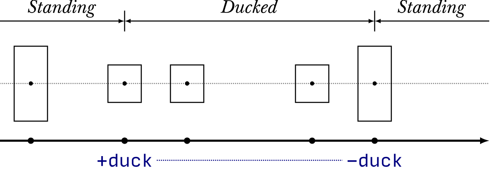
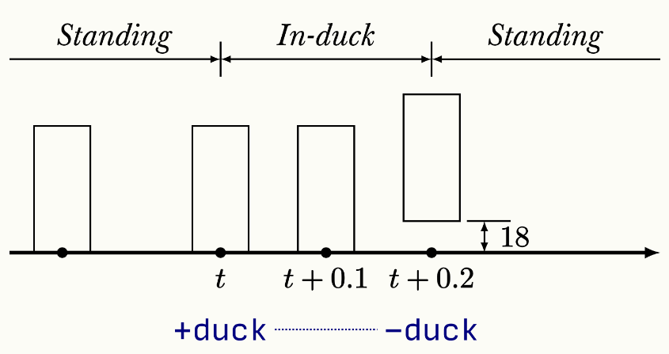

# Gordon And Daxter

A Jak 1 OpenGOAL Mod that attempts recreating Half-Life 1 movement and some weapons within GOAL.

Overall experience is smoother with the frame rate limit set to 150 fps.
## Main Changes

### Target Movement

The main changes were focused on Target (or Jak). Basically, it was added new states:

- target-hl-movement-ground
- target-hl-movement-ground-duck
- target-hl-movement-air
- target-hl-movement-air-duck
- target-hl-movement-swim

Target now only uses these states during gameplay which are far less than the default ones that won't be needed (default states include stuff such as default attacks, animation states, etc.).

#### Ground Movement
Ground movement is applied with ``hl-add-thrust`` (based on the default ``add-thrust``) which updates the target’s velocity based on input, friction, and acceleration.

At a high level, movement works like this:

<ol>
  <li>Read input</li>
    <ul>
      <li>The desired movement direction comes from <code>trans-targ</code> (built from input).</li>
      <li>Only horizontal movement (X/Z) is handled here — vertical velocity (jumping, falling) is preserved.</li>
    </ul>
  <li>Apply friction</li>
    <ul>
      <li>If the target is not jumping, friction is applied to slow down.</li>
      <li>This ensures we gradually come to a stop when no input is given.</li>
    </ul>
  <li>Apply acceleration</li>
    <ul>
      <li>Desired speed is capped to a maximum value</li>
      <li>Acceleration is applied only if we are not already moving fast enough in that direction</li>
    </ul>
  <li>Clamp maximum speed</li>
    <ul>
      <li>After acceleration, horizontal speed is clamped to prevent exceeding the allowed maximum speed.</li>
    </ul>
</ol> 

#### Duck Behavior

In Half-Life, when the player ducks while in mid-air, the collision shape shrinks while remaining centered. This is what allows the player to reach higher ledges.

Image from: https://www.jwchong.com/hl/duckjump.html

To replicate this behavior, I initially tried shrinking the collision by “removing” the target’s upper and bottom collision while keeping the middle intact. However, this caused issues when returning to the original collision size, resulting in the player clipping through terrain. In Half-Life, it is first checked whether there is enough space to restore the normal collision and then moves the player to the remaining available space, but I wasn’t able to implement this behavior.

Instead, the solution used here is to directly apply the same height that the collision center would have after shrinking (plus a small extra offset to make some jumps easier).

Another duck-related behavior from Half-Life is ducktapping. In Half-Life, when the duck key is held, the camera begins moving downward, and after 0.4 seconds the player’s collision immediately switches to the ducked state (while in the air, this transition is instant). However, if the duck key is released before the 0.4-second threshold is reached, the player gains a small amount of height (18 units in HL).

Image from: https://www.jwchong.com/hl/duckjump.html

This behavior was replicated here by only transitioning from movement-ground to movement-ground-duck after the duck key has been held for 0.4 seconds. If the key is released before that time, we also gain a small amount of height.

### Target Collision

A small change was made to target collision to be closer to Half-Life’s player collision. Half-Life uses a box for player collision, while Jak uses three spheres, which can cause sliding when standing on edges. To improve this, I added four spheres at the bottom to flatten the collision shape, and it significantly improved the behavior. Since i could only add 3 more spheres, i had to move the middle sphere to the bottom to make it 4.

### Controls

Controls were changed for supporting mouse and keyboard only and currently cannot be rebound.

<ul>
  <li>WASD</li>
  <ul>
    <li>Moves forward, back, left and right</li>
  </ul>
  <li>CTRL</li>
  <ul>
    <li>Duck</li>
  </ul>
  <li>Shift</li>
  <ul>
    <li>Walks</li>
  </ul>
  <li>E</li>
  <ul>
    <li>Same as pressing circle</li>
  </ul>
  <li>Tab</li>
  <ul>
    <li>Shows the HUD</li>
  </ul>
  <li>Q</li>
  <ul>
    <li>Last weapon switch</li>
  </ul>
  <li>1, 2, 3</li>
  <ul>
    <li>Switch to Crowbar, pistol and SMG respectively</li>
  </ul>
  <li>R</li>
  <ul>
    <li>Reload</li>
  </ul>
  <li>Mouse1</li>
  <ul>
    <li>Primary Attack</li>
  </ul>
  <li>Mouse2</li>
  <ul>
    <li>Secondary Attack</li>
  </ul>
  <li>ESC</li>
  <ul>
    <li>Pause</li>
  </ul>
  <li>Arrow Keys</li>
  <ul>
    <li>Navigating in menus</li>
  </ul>
  <li>Backspace</li>
  <ul>
    <li>Return in menus, skip cutscenes, select "NO"</li>
  </ul>
</ul>

It was also added settings for jumping and ducking using the mouse wheel.

### Weapons

The shooting mechanics consist of using ``fill-and-probe-using-line-sphere`` which casts a line from the center of our camera to a fixed range. When firing, a projectile is spawned at the collision point of the probe (basically, it creates small yellow eco fireballs at where we are aiming).

Currently, only 3 weapons are implemented. They are drawn using a new renderer which is  ``viewmodel`` and all their animation stuff and logic are in a new process called ``hl-weapons`` which contains the behavior of all the weapons such as reload time, firerate, switching weapons, etc. Also, ammo is unlimited.

#### Crowbar

The crowbar works the same as shooting with the other weapons except it has far less range and creates a bigger projectile where it connects. It also deals double the damage as the other weapons except the grenades.

#### Pistol

Deals the same damage as the SMG but has higher accuracy. It also has a secondary attack with higher fire rate but less accuracy.

#### SMG

Same damage has the pistol, less accuracy but higher firerate. Its secondary attack is the grenade launcher which deals the most damage, but its most useful function is the grenade jump which is needed in order to perform most of the jumps to be able to progress in the game. The grenade its basically a bomb from the cannons of the vanilla game but with changes to its gravity and a new model.